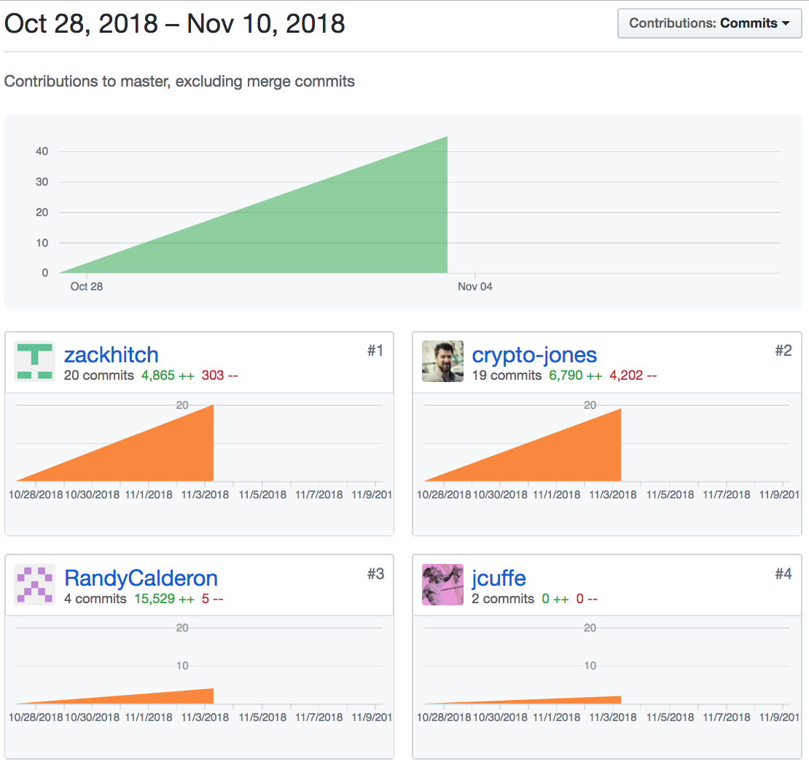

We started off the week a little bit unsure of the structure of our application and an unfamiliarity with some of the technologies we would be using. 

On Monday, I met with my team to discuss what stack we would be using, and code style guidelines. We also discussed our vision for how the app should function. After our meeting, I proceeded to research the things none of us were familiar with,namely Docusign and Chainpoint. I started with Chainpoint and after spending some timw with thair documentation, I felt that the best thing for us to use was their Chainpoint Javascript Client. This installs as an NPM package and seemed really straightforward and easy to use.

Next, I tackled the DocuSign documentation. In contrast to the Chainpoint docs, they are massively bloated, confusing, and unclear about many things. After many hours of reading, I was finally able to pinpoint some of the methods needed to implement the functionality we want. I was able to set up a Docusign Developer account, and set up testing enviornment in 
Postman with all of the pertinent information we would need for our API calls.

On Wednesday, I pair programmed almost all day with my teammate, Brandon. We worked on allowing a user to Docusign  through our app using Auth0. We also worked on trying to embed the Docusign Web App into our application. We came away a bit unsure if this was the best route to take, because it seemed we were unable to get back to our app from DocuSign. Later, I went through a tutorial from DocuSign that went over how to continually get the status of a user's Envelopes by polling DocuSign.

Thursday morning, I finished up the tutorial before standup, and then again proceeded to pair program intensively with Brandon for the entire rest of the day. We were able to set up a method for monitoring a user's Docusign account. After that we worked on retrieving a user's documents from DocuSign and displaying them in our application. I think Brandon and I both agree that Docusign's documentation, while very lengthy, is not always very clear.

Friday, upon reflecting on my week, I can't believe how lucky I am to be assigned to this team. Everyone is very enthusiastic about the project and very easy to get along with. We meet up at least two times every day, outside of standup, to discuss where we are at, where we are going, and if anyone needs help getting there. All voices are heard at our meetings; we make sure the less outgoing team members  express their ideas and opinions as well as the more outgoing members. This also helps us to bond and solidify as a team. There has yet to be any friction in our group because everyone is easygoing and respectful of everyone else. We are all team players who are willing to help each other out and I am ecstatic to be a part of it.

[Netlify](https://chainpoint-docusign.netlify.com/)

[Heroku](https://chainpoint-docusign-server.herokuapp.com/)

