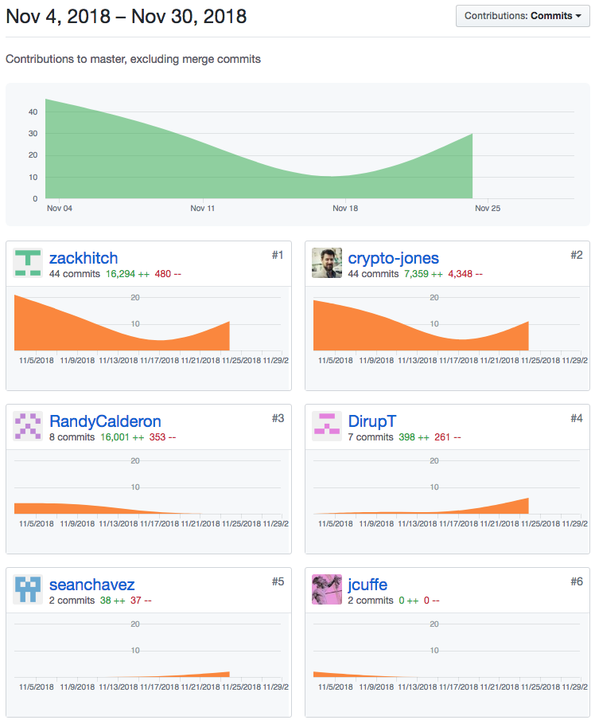
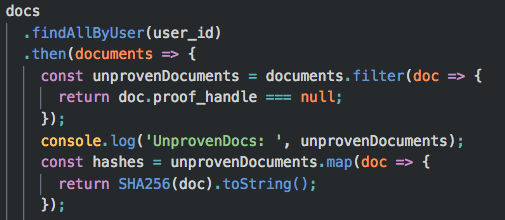

After a long week away from the project, it took a little while to clean out the cobwebs Monday morning. Once I was dialed in, I began working on getting Chainpoint proofs into our database. After successfully proofing all of a user's document's and saving them, I began working on making sure that we were only sending unproofed documents to Chainpoint, and associating the correct proof with the correct document in our documents table. Once that was working, I consulted with Brandon, as he had been working with the documents and proofs also. We teamed up to make sure the code I had written on the backend, would work with the code he had written on the frontend. We proceeded to work through the flow of our application from 'click to proof' to 'cal proof' in our database to 'btc proof' in our database. After much debugging, we eventually got everything working properly.

Something I spent a bunch of time on was implementing the Chainpoint route. First, I filtered the unproofed documents by checking the documents table for which documents had a null value for 'proof_handles' (meaning they were unproofed).

After submitting the hashed documents, Chainpoint returns an array of 'proof_handles'(three proof_handles per document, coming from different nodes). The proof handles are then submitted to get the proofs. We needed to associate each returned proof handle and verified proof with the correct document so we culd save them. I accomplished this by comparing the 'hash' property on the 'proof_handle' and 'verified_proof objects to the hash of the data sent to Chainpoint. If the hashes match, they go together.
We decided to then store the returned Chainpoint data in JSON form in order to keep the shape of the data.

