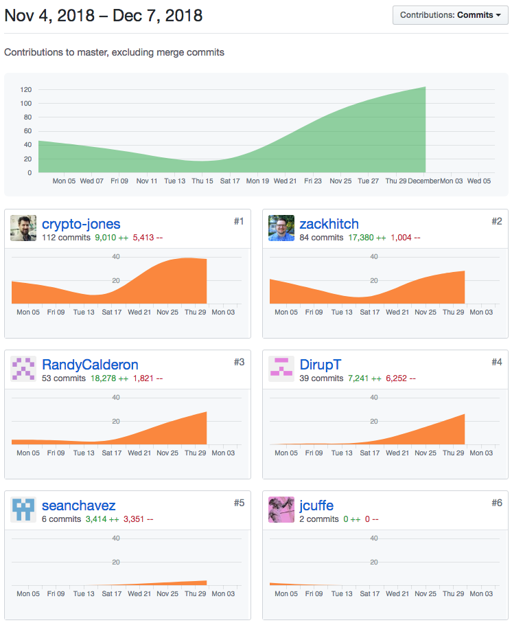
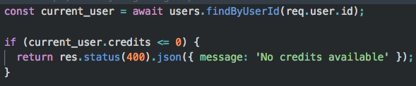

####Ticket 1:
* [Github](https://github.com/Lambda-School-Labs/ChainPointDocusign/pull/130)
* [Trello](https://trello.com/c/ZESeLeU4)

####Ticket 2:
* [Github](https://github.com/Lambda-School-Labs/ChainPointDocusign/pull/132)
* [Trello](https://trello.com/c/1PdlJPpK)

####Ticket 3:
* [Github](https://github.com/Lambda-School-Labs/ChainPointDocusign/pull/142)
* [Trello](https://trello.com/c/uiJVhIn2)

This week the team really started focusing on the frontend and the look of the app. We also really started to notice all the little bugs we had. I mostly worked with Brandon on bugfixes.

One of the bugs was that we were allowing a user to proof a document when they had no credits. We fixed this by first adding some logic to the chainpoint route that finds the current user and checks if they have any credits. If they don't, we return a meessage leting them know. We also made it so that the user will be redirected to the buy credits page when they click to proof with no credits.

It was really amazing to see the transformation of our app from something that was kind of plain, to a well designed masterpiece. As I clicked around our application at the end of the week, I just couldn't believe how professional it looked; not like the work of a student team. The group continued to work well together, staying in constant communication, pair programming, and everyone willing to help out anyone that needs it. There was a little bit more stress this week because there was a lot to do, we were running out of time, and we didn't realize we had so many bugs, but my teammates handled it very well and nothing ever got tense between us.

[Netlify](https://chainpoint-docusign.netlify.com/)

[Heroku](https://chainpoint-docusign-server.herokuapp.com/)
