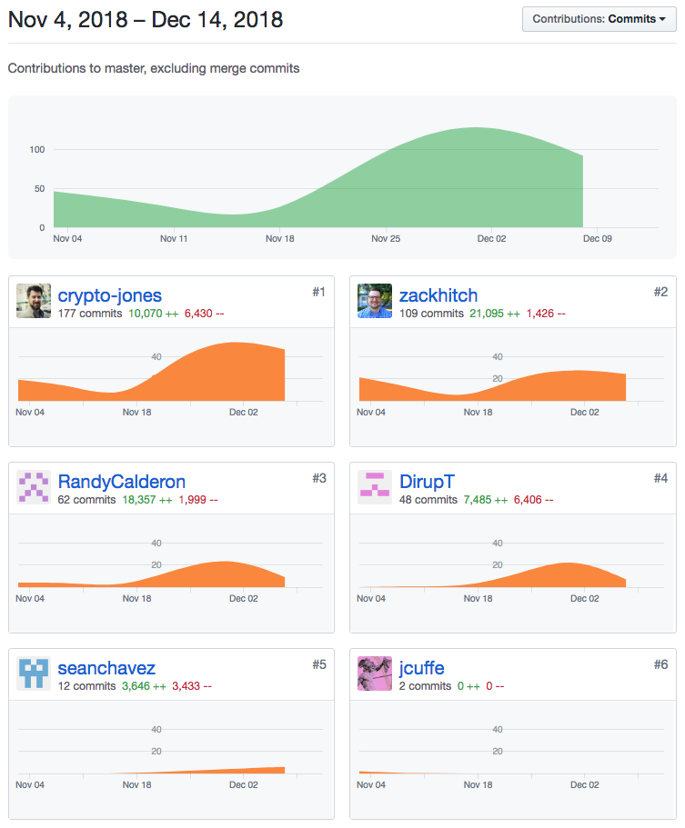

####Ticket 1:

- [Github](https://github.com/Lambda-School-Labs/ChainPointDocusign/pull/187)
- [Trello](https://trello.com/c/gPchXoiB)

####Ticket 2:

- [Github](https://github.com/Lambda-School-Labs/ChainPointDocusign/pull/195)
- [Trello](https://trello.com/c/uISK1HAF)

####Ticket 3:

- [Github](https://github.com/Lambda-School-Labs/ChainPointDocusign/pull/194)
- [Trello](https://trello.com/c/J3TW9LGw)

####Ticket 4:

- [Github](https://github.com/Lambda-School-Labs/ChainPointDocusign/pull/200)
- [Trello](https://trello.com/c/wgaAbBzr)

####Ticket 5:

- [Github](https://github.com/Lambda-School-Labs/ChainPointDocusign/pull/202)
- [Trello](https://trello.com/c/S3jmbn9v)

With our Capstone Defense looming and a final presentation on Friday, the team really kicked things into full detail mode. We thoroughly went over the details of our application, fixing bugs, adding things we missed, and making things that looked good,look great. Everyone worked extremely hard to deliver this impressive product on time.

One of the main things I worked on was an 'about us' page. While we initially had this as a stretch goal, we realized it was going to be necessary, as potential employers might be looking at our site. We decided to display the five engineering team members plus our UX/UI designer in two rows of three, with our project manager in a third row centered on the page. The team also decided to display round photos with icons that link to our respective LinkedIn and Github accounts. First, I created a route for this in the Home component with all the other routes. Since these routes were protected, I later added some logic to our App component (which acts as a landing page) allowing the 'team' page to be accessed from there when a user is not logged in.

Even though though we all tried not to underestimate the difficulies of finishing the last bit of the project, I think we were all surprised by the amount of little bugs we found when we really started looking for them. I personally spent a bunch of time going insane trying to fix some console errors. Another bug that was kind of stressful was that when you go to a page, you would be at the bottom of the page. We're not sure when this got introduced, but we didn't catch until about two hours before our final presentation. We were really scrambling for awhile, but just as we had done the previous five weeks, we pulled together as a team and got it fixed in time.

For this application, our frontend was built with React and Redux, with Styled-Components for the styling. The backend was built with Node and Express, with PostgreSQL for the database.

Our application links up with a user's DocuSign account, takes a signed document, hashes the data and sends it to Chainpoint, which then validates the hash and in turn,anchors it the Bitcoin blockchain thereby ensuring the validity and integity of the data.

[Netlify](https://chainpoint-docusign.netlify.com/)

[Heroku](https://chainpoint-docusign-server.herokuapp.com/)
